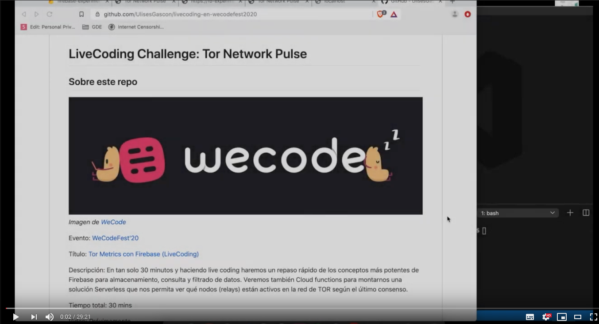
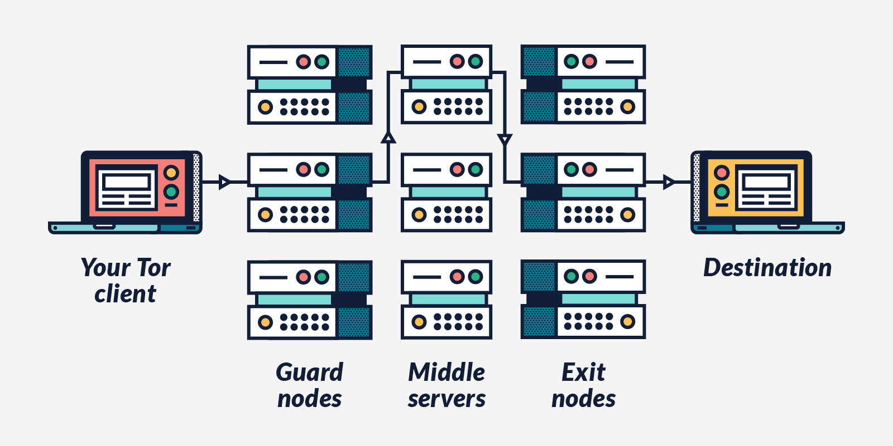
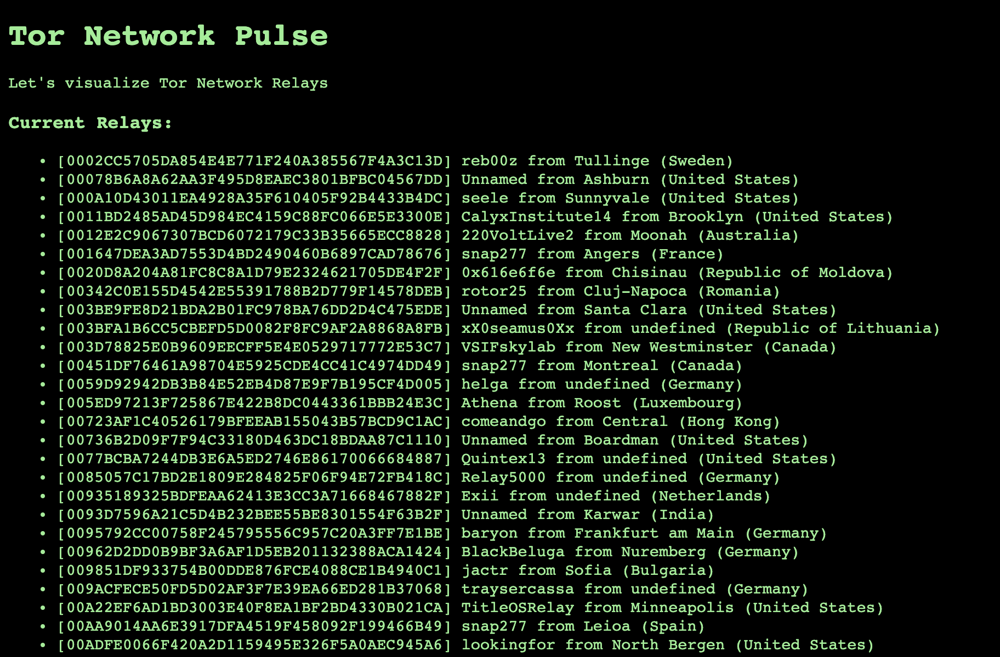

<h2 align="center">:warning: This repository is not longer maintained :warning:</h2>


# LiveCoding Challenge: Tor Network Pulse

## Sobre este repo


_Imagen de [WeCode](https://pbs.twimg.com/profile_banners/894146789716217856/1579883925/1500x500)_

Evento: [WeCodeFest'20](https://wecodefest.com/)

Título: [Tor Metrics con Firebase (LiveCoding)](https://wecodefest.com/#ug-firebase)

Descripción: En tan solo 30 minutos y haciendo live coding haremos un repaso rápido de los conceptos más potentes de Firebase para almacenamiento, consulta y filtrado de datos. Veremos también Cloud functions para montarnos una solución Serverless que nos permita ver qué nodos (relays) están activos en la red de TOR según el último consenso.

Tiempo total: 30 mins

## Video del Live Coding

[](https://www.youtube.com/watch?v=0j0wNQZK9ws)


## El reto

Nota: Al contar con solo 30 minutos, utilizaremos la técnica de SDD (Snippets Driven Development) y mucha magia. El objetivo principal es sumergirnos de lleno en el mundo de Firebase y ser capaces de desarrollar una aplicación serverless lo más rápido posible.

### Contexto

#### TOR


_Image by [Tor Project](https://www.torproject.org/static/images/tor-project-logo-onions.png)_

> Tor es la sigla de The Onion Router (en español: El Rúter Cebolla). Es un proyecto cuyo objetivo principal es el desarrollo de una red de comunicaciones distribuida de baja latencia y superpuesta sobre internet, en la que el encaminamiento de los mensajes intercambiados entre los usuarios no revela su identidad, es decir, su dirección IP (anonimato a nivel de red) y que, además, mantiene la integridad y el secreto de la información que viaja por ella. Por este motivo se dice que esta tecnología pertenece a la llamada darknet o red oscura que no se debe confundir con la deep web o web profunda.
> 
> Para la consecución de estos objetivos se ha desarrollado un software libre específico. Tor propone el uso de encaminamiento de cebolla de forma que los mensajes viajen desde el origen al destino a través de una serie de routers especiales llamados 'routers de cebolla' (en inglés onion routers). El sistema está diseñado con la flexibilidad necesaria para que pueda implementar mejoras, se despliegue en el mundo real y pueda resistir diferentes tipos de ataque. Sin embargo, tiene puntos débiles y no puede considerarse un sistema infalible.
> [Wikipedia](https://es.wikipedia.org/wiki/Tor_(red_de_anonimato))



_Image by [The best VPN](https://thebestvpn.com/wp-content/uploads/2018/08/how-does-tor-work.jpg)_

**Recursos**
- [:tv: Cómo protege su privacidad e identidad en línea su Navegador Tor](https://www.youtube.com/watch?v=Sz_J6vJ4MYw)
- [:video_camera: [MorcillaConf] TOR para Developers 101 - Ulises Gascon](https://www.youtube.com/watch?v=Oye2y5-HSMU)
- [:tv: El creador de Tor te explica cómo navegar con seguridad](https://www.youtube.com/watch?v=tEJsKW8AFxs)
- [:page_facing_up: Tor Wikipedia](https://es.wikipedia.org/wiki/Tor_(red_de_anonimato))
- [:page_facing_up: Tor Project Web](https://www.torproject.org/)
- [:page_facing_up: Tor Docs](https://2019.www.torproject.org/docs/documentation.html.en)
- [:page_facing_up: Tor History](https://www.torproject.org/about/history/)
- [:page_facing_up: Tor Metrix](https://metrics.torproject.org/)
- [:page_facing_up: Tor Reports](https://www.torproject.org/about/reports/)


#### Firebase


_Image by [Firebase](https://firebase.google.com/images/social.png)_

> Firebase es una plataforma para el desarrollo de aplicaciones web y aplicaciones móviles desarrollada por James Tamplin y Andrew Lee en 2012 y adquirida por Google en 2014.
> 
> Es una plataforma ubicada en la nube, integrada con Google Cloud Platform, que usa un conjunto de herramientas para la creación y sincronización de proyectos que serán dotados de alta calidad, haciendo posible el crecimiento del número de usuarios y dando resultado también a la obtención de una mayor monetización.
> 
> Los desarrolladores tendrán una serie de ventajas al usar esta plataforma:
> 
> - Sincronizar fácilmente los datos de sus proyectos sin tener que administrar conexiones o escribir lógica de sincronización compleja.
> - Usa un conjunto de herramientas multiplataforma: se integra fácilmente para plataformas web como en aplicaciones móviles. Es compatible con grandes plataformas, como IOS, Android, aplicaciones web, Unity y C++.
> - Usa la infraestructura de Google y escala automáticamente para cualquier tipo de aplicación, desde las más pequeñas hasta las más potentes.
> - Crea proyectos sin necesidad de un servidor: Las herramientas se incluyen en los SDK para los dispositivos móviles y web, por lo que no es necesario la creación de un servidor para el proyecto.
> 
>_[Wikipedia](https://es.wikipedia.org/wiki/Firebase)_ 


**Recursos**
- [:page_facing_up: Firebase Web Site](https://firebase.google.com/)
- [:video_camera: Live Coding (T1C2) | Desarrollando una app desde cero con Firebase](https://www.youtube.com/watch?v=A7FfQvh7IUc&list=PLLJLv7v6O42ELFNx3BtWrRXWmZv0ijlXd&index=2)
- [:page_facing_up: Firebase Pricing](https://firebase.google.com/pricing)
- [:page_facing_up: Firebase Products](https://firebase.google.com/products)
- [:page_facing_up: Firebase casos de uso](https://firebase.google.com/use-cases)


### Objetivo

Nos descargaremos la información de la infraestructura red de TOR (consenso) de [Onionoo](https://onionoo.torproject.org/details). Nos centraremos en los relays exclusivamente (ignorando Bridges, etc...). Cada Relay cuenta con un montón de información relevante:

```json
{
  "relays":[
    {
      "nickname":"reb00z",
      "fingerprint":"0002CC5705DA854E4E771F240A385567F4A3C13D",
      "or_addresses":[
        "155.4.197.206:9001"
      ],
      "dir_address":"155.4.197.206:9030",
      "last_seen":"2020-01-19 18:00:00",
      "last_changed_address_or_port":"2019-10-08 08:00:00",
      "first_seen":"2019-10-08 08:00:00",
      "running":true,
      "flags":[
        "Fast",
        "Guard",
        "HSDir",
        "Running",
        "Stable",
        "V2Dir",
        "Valid"
      ],
      "country":"se",
      "country_name":"Sweden",
      "region_name":"Stockholm",
      "city_name":"Tullinge",
      "latitude":59.2,
      "longitude":17.8833,
      "as":"AS8473",
      "as_name":"Bahnhof AB",
      "consensus_weight":3600,
      "verified_host_names":[
        "h-197-206.A328.priv.bahnhof.se"
      ],
      "last_restarted":"2019-10-29 23:31:50",
      "bandwidth_rate":3276800,
      "bandwidth_burst":6553600,
      "observed_bandwidth":3801460,
      "advertised_bandwidth":3276800,
      "exit_policy":[
        "reject *:*"
      ],
      "exit_policy_summary":{
        "reject":[
          "1-65535"
        ]
      },
      "contact":"torrelaj(at)kabooz(dot)net [tor-relay.co]",
      "platform":"Tor 0.3.5.8 on Linux",
      "version":"0.3.5.8",
      "version_status":"recommended",
      "effective_family":[
        "0002CC5705DA854E4E771F240A385567F4A3C13D"
      ],
      "consensus_weight_fraction":0.000052284006,
      "guard_probability":0.00007920656,
      "middle_probability":0.00005936441,
      "exit_probability":0,
      "recommended_version":true,
      "measured":true
    }
  ]
}
```

Usaremos esa información para API que nos permita consultar los detalles de los relays y además montaremos un HTML sencillito que consuma los datos usando AJAX.



## ¿Cómo lo haremos?


_Gif de [Giphy](https://giphy.com/gifs/clasharama-BHNVC6suWIKs)_


### Desarrollo incremental
Empezaremos desarrollando en local para sentirnos cómodos con el desarrollo (monolito).

Objetivos:
- Descargar el [JSON de Onionoo](https://onionoo.torproject.org/details) y nos quedaremos colo con lo relacionado Relays
- Subiremos esa información a Firestore desde nuestra máquina
- Creamos un pequeño controlador para gestionar peticiones y actulizaciones hacia Firestore
- Montaremos un servidor web con Express para consultar los datos
	- [GET] `/api/v1/realys` - Todos los relays _Nota: Limitar a 100 para no cargar la red_
	- [GET] `/api/v1/realys/:fingerprint` - Filtar Relays por Fingerprint
	- [GET] `/api/v1/relays/country/:countryCode` - Filtrar Relays por Pais
- Montaremos un pequeño front (HTML, vanillajs) con una llamada Ajax para consultar la información de los relays de España

Notas (por si la conexión fuera mala) partimos de un biolerplate con dependencias y configuración listas:
- El proyecto de Firebase fue inicializado.
- Se han añadido algunos extras de configuración de los que hablaremos durante el livecoding
- Ya estan instaladas las librerías que usaremos
- Los secrets necesarios para el desarrollo local ya están generados y descargados
- Puedes ver todos estos cambios en el historial de commits.


### Migración a Firebase (:raised_hands: Serverless)

Refactorizaremos nuestro proyecto para que funcione en Firebase como una solución Serverless

- Usaremos [Google Cloud Scheduler](https://cloud.google.com/scheduler/) para crear un CRON job que descargue la información del estado de la red cada hora _CRON Format: `0 * * * *`_
- Usaremos [Google Cloud Functions para Firebase](https://firebase.google.com/docs/functions) para subir nuestra API de consulta
- Usarmeos [Firebase Hosting](https://firebase.google.com/docs/hosting?hl=es-419) para subir nuestro Front y realizar las llamadas ajax a nuestro backend (serverless)

**Recursos**
- [:notebook: Firebase Welcome Guide](https://firebase.google.com/docs/web/setup?hl=es-419)
- [:notebook: Firebase Guía de Hosting](https://firebase.google.com/docs/hosting?hl=es-419)
- [:notebook: Firebase Guía de Firestore](https://firebase.google.com/docs/firestore?hl=es-419)
- [:notebook: Firebase Guía de Cloud Functions](https://firebase.google.com/docs/functions?hl=es-419)
- [:blue_book: Github | Firebase Functions Samples](https://github.com/firebase/functions-samples)

### Librerías

- [express](https://www.npmjs.com/package/express): _Fast, unopinionated, minimalist web framework for node._
- [firebase](https://www.npmjs.com/package/firebase): _Firebase JavaScript library for web and Node.js_
- [firebase-admin](https://www.npmjs.com/package/firebase-admin): _Firebase admin SDK for Node.js_
- [got](https://www.npmjs.com/package/got): _Human-friendly and powerful HTTP request library for Node.js_
- [cors](https://www.npmjs.com/package/cors): _Node.js CORS middleware_

### Tienes los PRs post evento aqui:
- PR #1 [Solution: Old School environment](https://github.com/UlisesGascon/livecoding-en-wecodefest2020/pull/1)
- PR #2 [Solution: Serverless](https://github.com/UlisesGascon/livecoding-en-wecodefest2020/pull/2)


## [Snippets](snippets.md)


_¡:steam_locomotive: Viva [Code Train](https://www.youtube.com/user/shiffman/videos) :steam_locomotive:!_

### [Snippets for Development](snippets.md#snippets-for-development)
- [Firebase CLI](snippets.md#firebase-cli)
- [GOT](snippets.md#got)
- [Express](snippets.md#express)
- [Firestore](snippets.md#firestore)
- [HTML5](snippets.md#html5)
- [Ajax](snippets.md#ajax)


### [Snippets para Migrar a Cloud](snippets.md#snippets-para-migrar-a-cloud)
- [Scheduler: CRON Jobs](snippets.md#scheduler-cron-jobs)
- [Functions: HTTP Request](snippets.md#http-requests)
- [Firestore](snippets.md#firestore-1)
